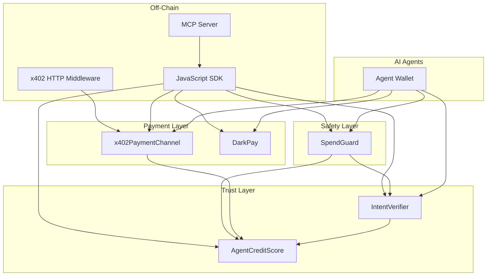

# Pharos Trust Stack — Architecture

Five composable on-chain Skills for the Pharos AI Agent economy (Atlantic Testnet, chain `688689`).

## System diagram



## Skill responsibilities

| Skill | On-chain role | Agent problem solved |
|-------|---------------|----------------------|
| **AgentCreditScore** | Soulbound NFT + score 0–1000 + credit tiers | Who is this agent? How much trust? |
| **IntentVerifier** | Commit-reveal (legacy + EIP-712) | Did the agent commit before acting? |
| **x402PaymentChannel** | Collateral channel + signed micropayments | Pay per API call without gas each time |
| **DarkPay** | Stealth addresses + announcements | Pay receiver without linking identity |
| **SpendGuard** | Custody + limits + whitelist + intent gate | Stop runaway agent spending |

## Data flows

### 1. Trust bootstrap

```
Agent → registerAgent() → ACS mints soulbound NFT
Agent → commitIntent() → revealIntent() → ACS.recordVerifiedIntent()
ACS.computeScore() → getCreditLimit()
```

### 2. Guarded spend

```
Controller → SpendGuard.createPolicy() + setWhitelist()
Agent → SpendGuard.deposit()
Agent → (optional) IntentVerifier commit/reveal for large spend
Agent → SpendGuard.guardedSpend(to, amount, intentId)
```

### 3. Micropayment channel

```
Agent → x402.openChannel{value}()
Agent signs off-chain payment message
Provider → x402.settlePayment(sig)
ACS.recordSuccessfulAction + recordRepayment
Agent → x402.closeChannel()
```

### 4. Stealth payment

```
Receiver → DarkPay.registerStealthMetaAddress()
Sender SDK → computeStealthAddress()
Sender → DarkPay.sendNativeStealth{value}()
Receiver scans announcements → deriveStealthPrivKey()
```

## Repository layout

```
pharos-skills/
├── src/                    # Solidity (5 contracts + interfaces/)
├── test/PharosSkills.t.sol # Forge: smoke, fuzz, stress, security
├── test/skills.test.js     # Hardhat integration
├── skills/<name>/          # Per-skill README + SKILL.md (BUIDL entry point)
├── sdk/                    # JavaScript SDK (all skills)
├── mcp-server/             # MCP tools for judge agents
├── x402-http/              # HTTP 402 Payment Required (Pharos x402 docs)
├── scripts/                # deploy, integrate, verify, judge readiness
└── deployments.example.json
```

## Security model

- `ReentrancyGuard` on all payable paths
- `Address.sendValue` (no `.transfer()`)
- `onlySkill` / `onlyRegisteredAgent` on ACS mutations
- Custom errors (no string reverts)
- IntentVerifier `penalized` flag (no double penalty)
- SpendGuard policy simulation via `canSpend()` before execution

See [`SECURITY.md`](SECURITY.md).

## Judge / agent testing

1. Clone repo → `./setup.sh` or `.\setup.ps1`
2. `npm run test:all` — full local suite
3. `npm run judge:readiness` — read-only Atlantic contract calls
4. `npm run mcp` — wire MCP config to your agent
5. Optional writes: fund `wallet.json` → `npm run integrate:atlantic`

## Phase 2 (NEXUS)

All five Skills compose into **NEXUS** — a credit-enabled, accountable, private, spend-safe autonomous agent on Pharos.
