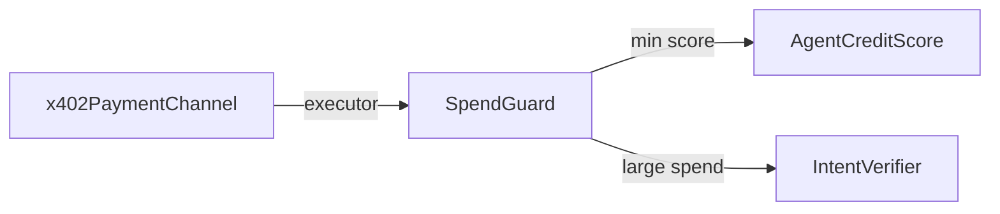

# SpendGuard — On-Chain Spending Limits for AI Agents

> **BUIDL folder:** https://github.com/henrysammarfo/pharos-skills/tree/master/skills/spendguard  
> **Verified:** https://atlantic.pharosscan.xyz/address/0x8395ada307Aa80C9F66A754fCC2CA01E63F9BB85#code  
> **Full stack:** https://github.com/henrysammarfo/pharos-skills

Credit-gated **custodial spending vault** for AI agents. Agents deposit PHRS; every spend enforces:

- Per-transaction limit
- Daily limit (UTC day rollover)
- Minimum `AgentCreditScore`
- Recipient whitelist
- Large-spend intent gate via `IntentVerifier`

## Judge quick test

```bash
git clone https://github.com/henrysammarfo/pharos-skills.git && cd pharos-skills
./setup.sh   # or: .\setup.ps1 on Windows
npm run judge:readiness
npm run test:all
npm run test:agent   # wallet writes: policy, deposit, guardedSpend
```

## Environment

```bash
export RPC=https://atlantic.dplabs-internal.com
export SPENDGUARD=0x8395ada307Aa80C9F66A754fCC2CA01E63F9BB85
export AGENT=0xYourAddress
export RECIPIENT=0xRecipientAddress
export AMOUNT_WEI=1000000000000000
export INTENT_ID=0
```

## Read-only Atlantic

```bash
cast call $SPENDGUARD "getPolicy(address)" $AGENT --rpc-url $RPC

cast call $SPENDGUARD "canSpend(address,address,uint256,uint256)(bool,bytes32)" \
  $AGENT $RECIPIENT $AMOUNT_WEI $INTENT_ID --rpc-url $RPC
```

## MCP tools

| Tool | Purpose |
|------|---------|
| `spendguard_can_spend` | Simulate policy without sending tx |
| `spendguard_get_policy` | Daily limit + remaining budget |
| `spendguard_balance` | Custodial balance |
| `spendguard_create_policy` | Create policy (wallet) |
| `spendguard_set_whitelist` | Whitelist recipient (wallet) |
| `spendguard_deposit` | Fund custody (wallet) |
| `spendguard_withdraw` | Withdraw (wallet) |
| `spendguard_guarded_spend` | Execute spend (wallet) |

Configure MCP: [`mcp-server/mcp-config.example.json`](../../mcp-server/mcp-config.example.json)

## Composability



## Key files

| File | Role |
|------|------|
| [`SKILL.md`](./SKILL.md) | Skill Engine manifest |
| [`../../src/SpendGuard.sol`](../../src/SpendGuard.sol) | Contract |
| [`../../test/PharosSkills.t.sol`](../../test/PharosSkills.t.sol) | Forge tests |
| [`../../ARCHITECTURE.md`](../../ARCHITECTURE.md) | Full mermaid architecture |
